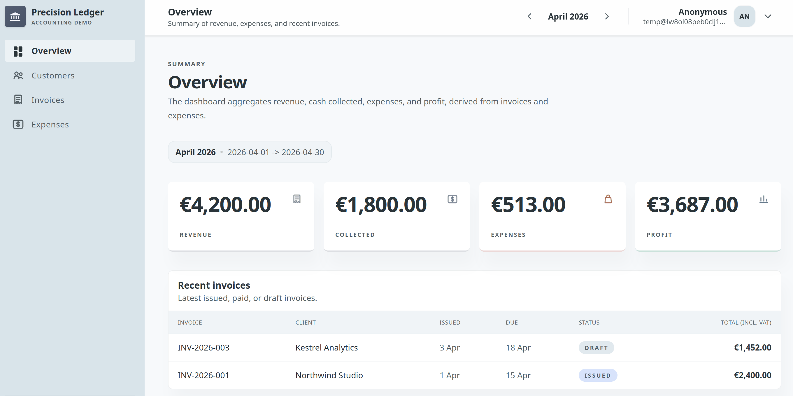

# Accounting Demo

A production-minded accounting system built to demonstrate backend engineering judgment.

This is not a tutorial project.

It focuses on the decisions real backend systems require: business invariants, authorization
boundaries, SQL modeling, reliability, and pragmatic trade-offs.

## Designed For Review

This repository was built to be readable in limited time: start with this README, then inspect
the architecture docs and the invoice module.

## What Makes It Interesting

- Multi-tenant workspace with explicit tenant boundaries
- RBAC with contextual authorization rules
- Invoice lifecycle (`draft -> issued -> paid`)
- Audit trail dependency with degraded read-only mode
- SQL-first persistence with Drizzle + PostgreSQL
- Risk-based test strategy (unit / integration / routes / browser)
- Containerized local and delivery workflow

## Product Walkthrough



Main flows covered:

- manage customers
- issue and track invoices
- confirm expenses
- monitor dashboard aggregates
- validate authorization boundaries

---

## What This Repository Shows

How I approach backend engineering in practice:

- model complexity where business risk is real
- keep simpler flows simple
- enforce invariants across services and database constraints
- make explicit trade-offs under delivery constraints
- design for maintainability, not accidental cleverness
- shipping with production awareness

---

## Tech Stack

### Backend

- AdonisJS
- TypeScript
- Drizzle ORM
- PostgreSQL
- Better Auth

### Frontend

- React
- Inertia
- Explicit request/response fetching (no React Query for this scope)

### Delivery

- Docker or Podman
- Multi-stage image build
- Runtime secrets
- Migration commands

### Why These Choices

- **AdonisJS**: ESM-native, productive, explicit, lower ceremony than heavier enterprise frameworks for this scope
- **Drizzle**: keeps SQL visible while preserving strong typing
- **Better Auth**: separates identity infrastructure from business authorization
- **React + Inertia**: server-driven UX with full-stack simplicity
- **No React Query**: explicit data flows were preferable to extra abstraction for this project size

---

## Architecture

The codebase is organized by business capability first.

Each module owns its HTTP boundary, application logic, and persistence concerns.

Inside the accounting context:

- `invoices` is intentionally rich
- `customers` and `expenses` remain flatter workflows

This reflects a deliberate principle: complexity should exist where domain risk exists.

### Project Structure

```text
app/core/
  accounting/{application,http,drizzle,routes,providers}
  user_management/{application,authorization,http,infra,providers}
  common/{middlewares,start}
inertia/{pages,layouts,components}
```

### Layering

```text
Routes
-> Middlewares (auth, tenant, read-only guards)
-> Controllers
-> Validators
-> Authorization checks (ability + subject)
-> Application services and use cases
-> Drizzle/PostgreSQL
```

---

## Business Capabilities

### Core Modules

- Customers
- Invoices
- Expenses
- Dashboard

### Security

- Authentication
- Authorization (RBAC abilities)
- Membership management
- Protected routes with active tenant checks

### Business Flows And Reliability

- Invoice lifecycle (`draft -> issued -> paid`) with server-authoritative totals
- Invoice audit history endpoint (`/invoices/:id/history`)
- Expense confirmation workflow with transactional journal write
- Degraded audit trail mode switches accounting writes to read-only
- Database-backed invariants and constraints

---

## Authorization Model

Main abilities used by accounting and membership flows:

- `accounting.read`
- `accounting.writeDrafts`
- `invoice.issue`
- `invoice.markPaid`
- `auditTrail.view`
- `membership.list`
- `membership.toggleActive`
- `membership.changeRole`

Role defaults:

- `member`: accounting read + draft writes
- `admin`: member abilities + issue/mark paid + audit trail view + membership list
- `owner`: admin abilities + membership role changes

See [RBAC and membership](docs/domain/rbac-membership.md) for details and contextual safeguards.

---

## Reliability And Ops

The system favors safe degradation over silent corruption.

- If audit trail storage is unhealthy, accounting write endpoints are blocked
- Read pages remain available and expose `accountingReadOnly` state
- JSON write attempts return `503 problem+json` until health is restored

Development-only operator tooling under `/_dev/inspector`:

- requires `devTools.access`
- enabled only in development
- operator IDs configured via `DEV_OPERATOR_PUBLIC_IDS`

---

## Run Locally

Use Docker Compose or Podman Compose for local services.
App runs on `http://localhost:3333`.

On Linux, use the bootstrap script for the fastest setup:

```bash
pnpm setup
pnpm services:up
pnpm dev
```

See [How to run locally](docs/getting-started/how-to-run.md) for what the bootstrap does,
including Compose services, local Docker secrets, and test scripts.

Useful commands:

- `pnpm db:up`: start only PostgreSQL (integration tests)
- `pnpm test`: run all backend test suites
- `pnpm test:integration`: run integration suite
- `pnpm playwright:install`: install browser runtime for browser tests

Expected setup:

- Node 24.x
- pnpm
- `podman compose` or `docker compose`

---

## Testing Strategy

Testing is treated as delivery infrastructure, not as optional polish.
Critical business flows are covered through isolated and integration-level tests.

Suites:

- `pnpm test:unit:backend`
- `pnpm test:integration`
- `pnpm test:routes`
- `pnpm test:console`
- `pnpm test:browser`

Test naming:

- `*.spec.ts` for unit
- `*.int.ts` for integration
- `*.feat.ts` for routes
- `*.e2e.ts` for browser

---

## Deliberate Scope Cuts

Out of scope for this demo:

- partial payments workflow
- multi-currency support
- VAT regime engine
- advanced dashboard analytics
- real-time updates
- advanced client-side caching

---

## Planned Extensions

- accounting journal postings on confirm flows
- pagination strategy refinement
- observability (logs / metrics / tracing)
- richer dashboard analytics
- background jobs

---

## Good Discussion Topics

- architecture trade-offs
- SQL vs ORM abstraction
- authorization design
- maintainability
- production delivery
- scope prioritization

---

## Documentation

See [Documentation](docs/README.md) for deeper technical material:

- [Review guide](docs/getting-started/review-guide.md)
- [How to run locally](docs/getting-started/how-to-run.md)
- [Architecture overview](docs/architecture/overview.md)
- [Invoice lifecycle](docs/domain/invoice-lifecycle.md)
- [Accounting authorization boundary](docs/architecture/accounting-boundary.md)
- [RBAC and membership](docs/domain/rbac-membership.md)
- [Roadmap](docs/roadmap/roadmap.md)
- [Architecture Decision Records](docs/adr/)

Detailed decisions are intentionally moved to [docs](docs/README.md) to keep this README concise.
